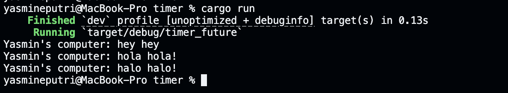
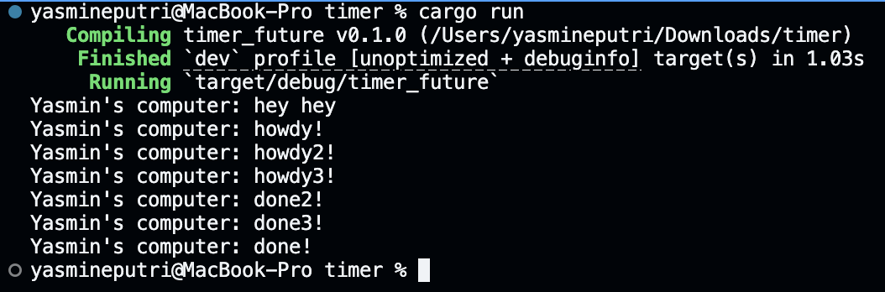

## Experiment 1.2

### Add another print before spawn

The println!("Yasmin's computer: hey hey"); is printed before the spawned async task because of the order of execution in the main function. When you call spawner.spawn(...), it schedules the async block (which prints "hola hola!" and "halo halo!") to run on the executor, but it does not execute it immediately. Instead, the main thread continues and immediately prints "hey hey" right after spawning the task. Only after this does the executor start running and process the queued async task, which then prints "hola hola!", waits for the timer, and finally prints "halo halo!". This demonstrates how spawning a task is non-blocking and allows the main thread to continue executing code right away.

## Experiment 1.3

### Add multiple spawns

When we add multiple spawns in our code, each call to spawner.spawn(async { ... }) schedules a new asynchronous task to be run by the executor. These tasks are not executed immediately; instead, they are placed in a queue. After spawning all the tasks, we print "Yasmin's computer: hey hey" right away, because the main thread continues executing without waiting for the tasks to finish. Once the executor starts running, it begins polling each task in the order they were queued. Each task prints its "howdy!" message, waits for the timer to complete, and then prints its "done!" message. Since all timers are set for the same duration and run concurrently, the "howdy!" messages appear first, followed by the "done!" messages, which may finish in any order depending on how the executor schedules them. This demonstrates how our simple executor can handle multiple concurrent tasks, allowing them to progress independently.